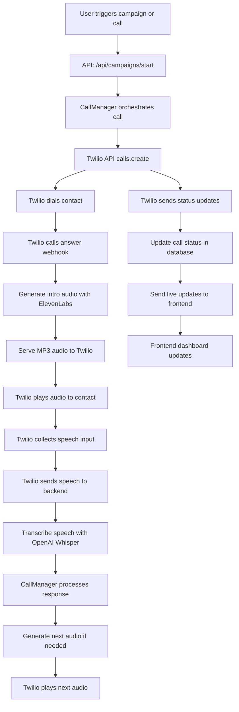

```mermaid
flowchart TD
    A[User triggers campaign or call] --> B[API: /api/campaigns/start]
    B --> C[CallManager orchestrates call]
    C --> D[Twilio API calls.create]
    D --> E[Twilio dials contact]
    E --> F[Twilio calls answer webhook]
    F --> G[Generate intro audio with ElevenLabs]
    G --> H[Serve MP3 audio to Twilio]
    H --> I[Twilio plays audio to contact]
    I --> J[Twilio collects speech input]
    J --> K[Twilio sends speech to backend]
    K --> L[Transcribe speech with OpenAI Whisper]
    L --> M[CallManager processes response]
    M --> N[Generate next audio if needed]
    N --> O[Twilio plays next audio]
    D --> P[Twilio sends status updates]
    P --> Q[Update call status in database]
    Q --> R[Send live updates to frontend]
    R --> S[Frontend dashboard updates]
```